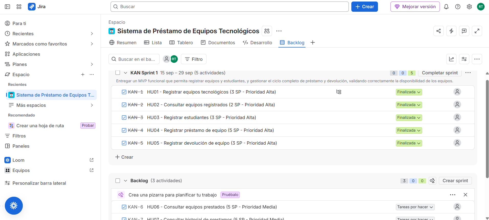
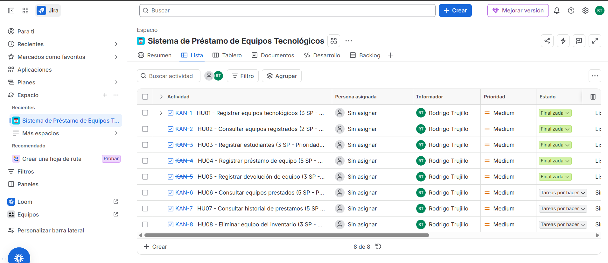
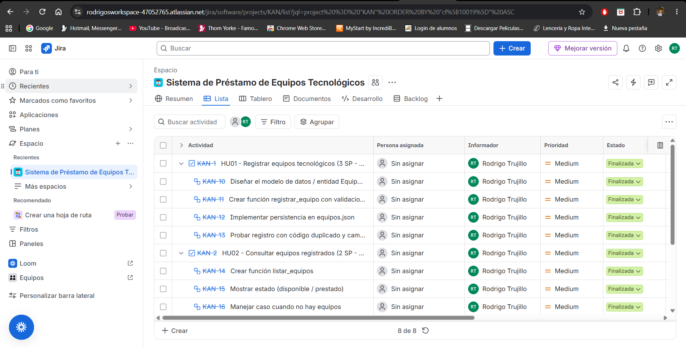
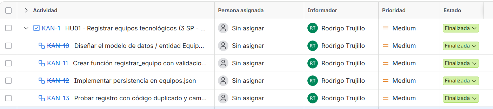

# Evidencias del Tablero de Gestión — Jira

**Proyecto:** Sistema de Préstamo de Equipos Tecnológicos  
**Herramienta:** Jira (Cloud)  
**Espacio:** KAN  
**Sprint:** KAN Sprint 1  

---

## 1. Vista del Backlog

---

## 2. Vista del Tablero Kanban

Se muestra el tablero con las columnas To Do, In Progress, In Review y Done.

---

## 3. Backlog con Sprint Completado

---

## 4. Detalle de la Historia HU01

Se observa la historia con sus subtareas finalizadas.

---

## Resumen

- Se utilizó **Jira** como herramienta de gestión.
- Se crearon las historias de usuario y se desglosaron en subtareas.
- Se gestionó el flujo de trabajo con el tablero Kanban.
- El Sprint 1 fue completado correctamente.

**Fecha de evidencia:** 16 de septiembre de 2026